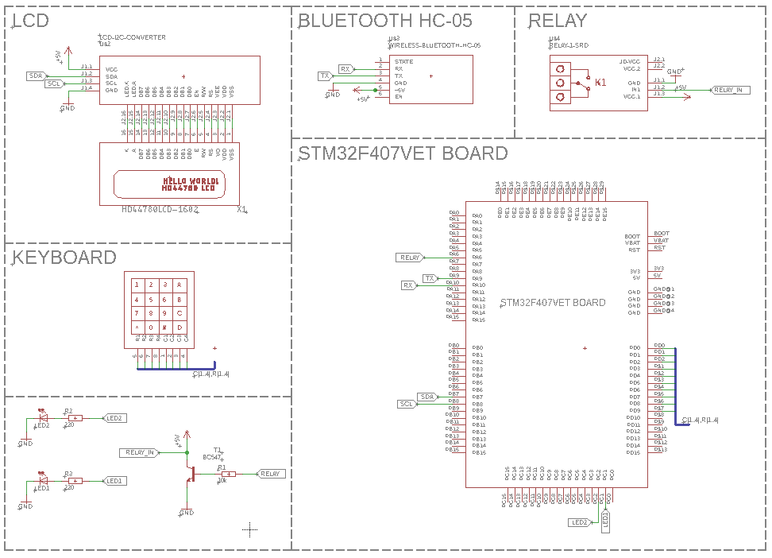

# Smart Home STM32F4 HAL
This is a academic project based on STM32F407VET6 Cortex-M4 CPU. The programming environment are STM32CubeIDE, QT 5.15 and Autodesk Eagle.
## Features
### Board
* Open door (relay) via physical keypad
* Display time on LCD
* Display code on LCD
* Display temperature on LCD
* Battery backup for RTC
### Aplication
* Connect with bluetooth
* Open door
* Turn on/off LEDs
* Get temperature 
* Get data if the door is opened

</br>Password can be set in Core/Src/main.c
```
#define PASSWORD "1234"
```
Relay open time (in seconds) can be set in Core/Src/main.c
```
#define RELAYOPENTIME 4
```

## Schematic


## Aplication (Windows and Android)


## Partlist
* STM32F407VET6 Development Board
* Keyboard 4x4
* Bluetooth HC-05
* LCD1602 with I2C module
* Relay module
* Transistor, LEDs, Resistors
